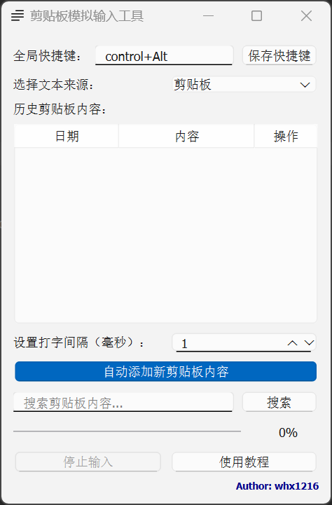

# 剪贴板模拟输入工具

## 项目简介

这是一个简单的剪贴板模拟输入工具，可以帮助用户快速、自动地输入剪贴板或自定义文本。支持全局热键触发，可以自定义输入速度，并提供剪贴板历史记录管理。主要用于粘贴内容于不可粘贴的位置（例：学习通）。

## 主要特性

- 🖱️ 支持两种文本来源：剪贴板和自定义文本框
- 📋 剪贴板历史记录管理
- ⌨️ 自定义全局热键触发
- 🚀 可调节输入速度
- 🔍 剪贴板内容搜索功能
- 📝 自动/手动添加剪贴板记录

## 环境依赖

- Python 3.7+
- PySide6
- pynput
- global_hotkeys

## 安装步骤
##### 直接使用Releases打包好的exe
或

1. 克隆仓库
```bash
git clone https://github.com/whx1216/simulation-input-tool.git
```

2. 安装依赖
```bash
pip install -r requirements.txt
```

3. 运行应用
```bash
python main.py
```

## 使用说明

1. 选择文本来源：剪贴板或文本框
2. 剪贴板模式下选择要粘贴的内容
3. 默认使用 Ctrl+Alt+V 开始粘贴（可自定义）
4. 调整输入速度
5. 使用搜索功能快速定位历史记录

## 截图

